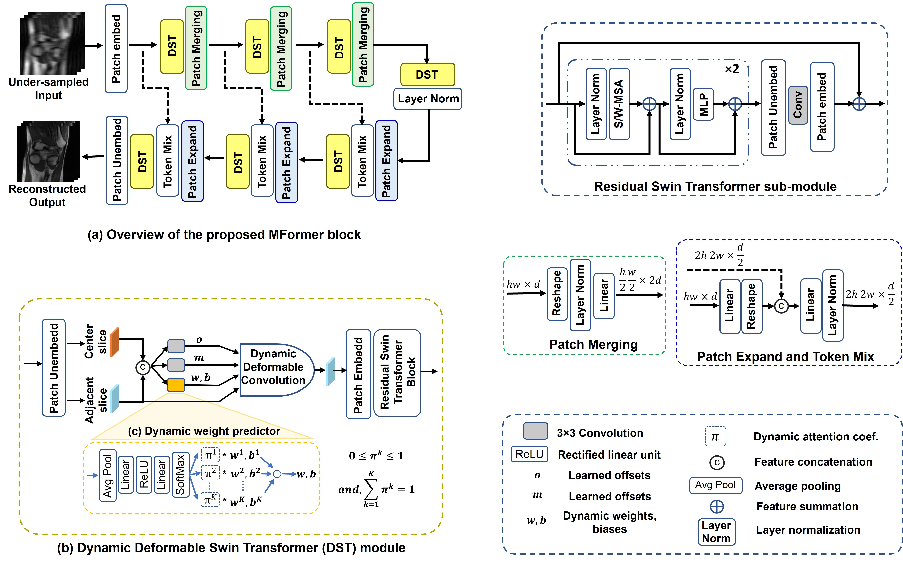

# MFomer

[Wafa Al Ghallabi](https://github.com/wafaAlghallabi),
[Akshay Dudhane](https://github.com/akshaydudhane16),
[Syed Waqas Zamir](https://scholar.google.es/citations?user=WNGPkVQAAAAJ&hl=en),
[Muzammal Naseer](https://scholar.google.ch/citations?user=tM9xKA8AAAAJ&hl=en),
[Salman Khan](https://salman-h-khan.github.io),
and [Fahad Shahbaz Khan](https://scholar.google.es/citations?user=zvaeYnUAAAAJ&hl=en) 

> **Abstract:** *Magnetic resonance imaging (MRI) is a slow diagnostic imaging technique due to the time-consuming acquisition speed. To overcome this, parallel imaging and compressed sensing methods have been developed. Parallel imaging acquires multiple views of the anatomy simultaneously, while compressed sensing acquires fewer samples than traditional signal processing methods. However, reconstructing images from undersampled multi-coil data is still a challenge. To tackle undersampled data, existing methods gather more information by concatenating the given input (current slice) and the adjacent slices along the channel dimension and processing them through the network for MRI reconstruction. We argue that an implicit feature alignment within adjacent slices is crucial to maximize the MRI reconstruction performance. To this end, we propose MFormer: accelerated MRI reconstruction transformer, which uses a cascade of MFormer blocks, each comprising multi-scale Dynamic Deformable Swin Transformer (DST) modules. Unlike existing methods, our DST modules implicitly align the adjacent slice features with the current slice at multiple scales using a dynamic deformable convolution and extract local non-local features through a series of residual swin transformer sub-modules before merging their information. To adapt the input variations, we aggregate the weights and biases of deformable convolution kernels through a dynamic weight predictor. Extensive experiments on Stanford2D, Stanford3D, and large-scale FastMRI datasets reveal the merits of the proposed contributions, leading to state-of-the-art MRI reconstruction performance.* 

## Contents
1. [MFormer](#Highlights)
2. [Code](#Installation)
8. [References](#References)

## MFomer

* We propose an approach, named MFormer, that utilizes a dynamic deformable swin transformer module to implicitly align the features of adjacent slices with the current slice at multiple scales, followed by their integration. Within the DST module, to perform feature alignment, we introduce a dynamic deformable convolution technique.
* In order to accommodate input variations, the proposed dynamic weight predictor aggregates the weights and biases of deformable convolution kernels. It learns the aggregation coefficient based on the variances observed in the center and adjacent slices.
* We conduct extensive experiments to validate the effectiveness of our MFormer on three datasets. Our MFormer demonstrated superior performance for MRI reconstruction and outperformed the recent HUMUS-Net
  

## Code

We will relase our code soon!

## References

Our code is build on the repository of [HUMUS-Net](https://github.com/z-fabian/HUMUS-Net).
